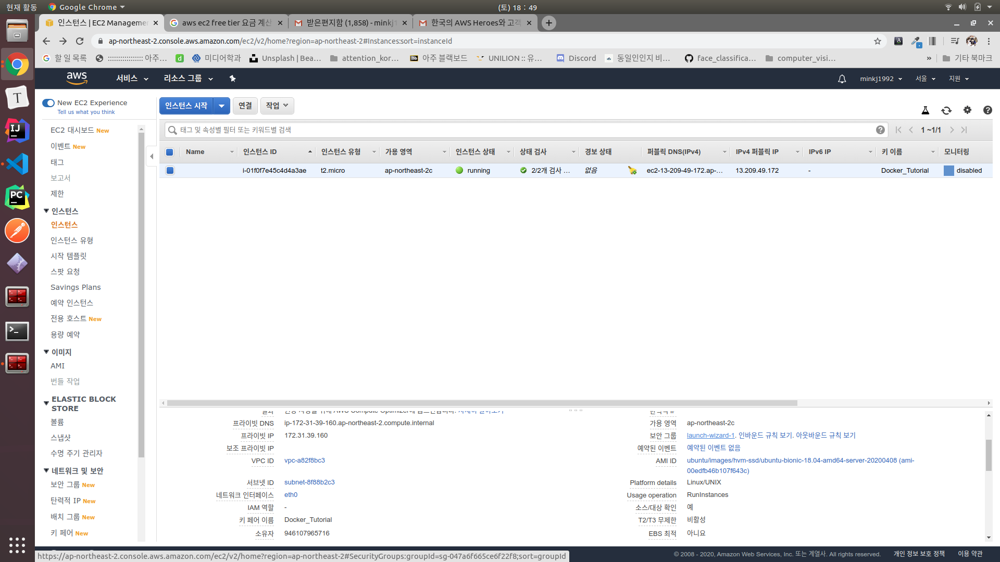

# 1. 실습용 AWS EC2 인스턴스 생성 및 접속

#### 0.0.1. aws ec2 instance 생성
> 이 과정에서 1달러 소모 되었다. 왜지? 

#### 0.0.2. local에서 .pem을 활용해 해당 인스턴스 연결
```bash
minkj1992@minkj1992-900X5L:~/code/docker-deploy-practice$chmod 400 Docker_Tutorial.pem 
minkj1992@minkj1992-900X5L:~/code/docker-deploy-practice$ssh -i "Docker_Tutorial.pem" ubuntu@ec2-13-209-49-172ap-northeast-2.compute.amazonaws.com
ubuntu@ip-172-31-39-160:~$ pwd
/home/ubuntu
```
#### 0.0.3. ec2



#### 0.0.4. ec2 port 열어주기


