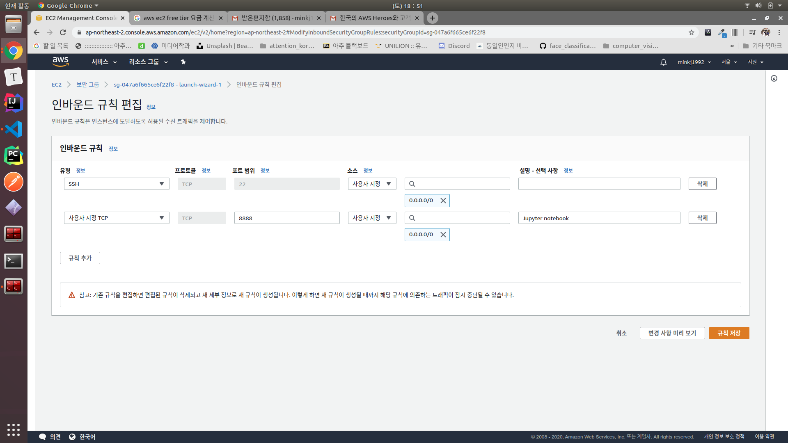

# 2. Jupyter Notebook 설치, HTTPS 적용, 시스템 서비스 설정하기

<!-- TOC -->

- [2. Jupyter Notebook 설치, HTTPS 적용, 시스템 서비스 설정하기](#2-jupyter-notebook-설치-https-적용-시스템-서비스-설정하기)
  - [1. jupyter notebook 설치](#1-jupyter-notebook-설치)
  - [2. jupyter notebook 비밀번호 설정](#2-jupyter-notebook-비밀번호-설정)
  - [3. 주피터 환경설정 파일](#3-주피터-환경설정-파일)
      - [3.0.1. 환경설정 파일 생성](#301-환경설정-파일-생성)
      - [3.0.2. `jupyter_notebook_config.py`](#302-jupyter_notebook_configpy)
      - [3.0.3. background에서 jupyter 돌도록 설정](#303-background에서-jupyter-돌도록-설정)
      - [3.0.4. ec2 보안포트 8888열어주기](#304-ec2-보안포트-8888열어주기)
      - [3.0.5. ipv4를 통하여 로그인](#305-ipv4를-통하여-로그인)
      - [3.0.6. 종료하기](#306-종료하기)
  - [4. 사설 공개/개인 ssl키 생성 (https 연결설정)](#4-사설-공개개인-ssl키-생성-https-연결설정)
      - [4.0.7. ssl 키 생성](#407-ssl-키-생성)
      - [4.0.8. jupyter config 추가](#408-jupyter-config-추가)
  - [5. 시스템 서비스 설정하기 (`.service`)](#5-시스템-서비스-설정하기-service)
      - [5.0.9. `.service`](#509-service)
      - [5.0.10. 데몬으로 주피터 노트북 등록](#5010-데몬으로-주피터-노트북-등록)
      - [5.0.11. 주피터 노트북 재부팅](#5011-주피터-노트북-재부팅)

<!-- /TOC -->

-------------- 

## 1. jupyter notebook 설치
    
```bash
ubuntu@ip-172-31-39-160:~$ sudo apt-get update
ubuntu@ip-172-31-39-160:~$ sudo apt-get install python3-pip
ubuntu@ip-172-31-39-160:~$ sudo pip3 install notebook
```

## 2. jupyter notebook 비밀번호 설정
```bash
ubuntu@ip-172-31-39-160:~$ python3
Python 3.6.9 (default, Apr 18 2020, 01:56:04) 
[GCC 8.4.0] on linux
Type "help", "copyright", "credits" or "license" for more information.
>>> from notebook.auth import passwd
>>> passwd()
Enter password: 
Verify password: 
'sha1:7373489a1043:898dc4bff616b1b1b3792214a7cb92676018db0b'
```

## 3. 주피터 환경설정 파일

#### 3.0.1. 환경설정 파일 생성
```bash
ubuntu@ip-172-31-39-160:~$ jupyter notebook --generate-config
Writing default config to: /home/ubuntu/.jupyterjupyter_notebook_config.py
ubuntu@ip-172-31-39-160:~/.jupyter$ sudo vi jupyter_notebook_config.py
```

#### 3.0.2. `jupyter_notebook_config.py`

```python
# ... 중략 ...
c = get_config()
c.NotebookApp.password= u'sha1:7373489a1043:898dc4bff616b1b1b3792214a7cb92676018b0b'
c.NotebookApp.ip = '172.31.39.160'
c.NotebookApp.notebook_dir = '/'
```

#### 3.0.3. background에서 jupyter 돌도록 설정
```bash
 ubuntu@ip-172-31-39-160:~$ sudo jupyter-notebook --allow-root
 [I 09:36:36.597 NotebookApp] Serving notebooks from local directory: /
 [I 09:36:36.597 NotebookApp] The Jupyter Notebook is running at:
 [I 09:36:36.597 NotebookApp] http://172.31.39.160:8888/
 [I 09:36:36.597 NotebookApp] Use Control-C to stop this server and shut down all kernels (twice to skip confirmation).
 [W 09:36:36.601 NotebookApp] No web browser found: could not locate runnable browser.
                                 
 ^Z
 [1]+  Stopped                 sudo jupyter-notebook --allow-root

 ubuntu@ip-172-31-39-160:~$ bg
 [1]+ sudo jupyter-notebook --allow-root &
 ubuntu@ip-172-31-39-160:~$ disown -h
```

> 요약 : 원격 쉘에서 프로세스가 진행중일 때 일단 Ctrl+Z 를 눌러서 일시정지를 시킨다. 그리고 bg 라고 쳐서 정지된 프로세스를 백그라운드로 돌린다. 그 다음 disown 이라고 치면 내 거가 아니라고 선언되면서, 내가 접속을 끊어도 계속 작업이 돌아가게 된다.


#### 3.0.4. ec2 보안포트 8888열어주기


#### 3.0.5. ipv4를 통하여 로그인

#### 3.0.6. 종료하기
```bash
ubuntu@ip-172-31-39-160:~$ sudo netstat -nap | grep 8888
tcp        0      0 172.31.39.160:8888      0.0.0.0:*               LISTEN      7509/python3        
ubuntu@ip-172-31-39-160:~$ sudo kill -9 7509
[1]+  Killed                  sudo jupyter-notebook --allow-root
```

## 4. 사설 공개/개인 ssl키 생성 (https 연결설정)

#### 4.0.7. ssl 키 생성
```bash
ubuntu@ip-172-31-39-160:~$ mkdir ssl
ubuntu@ip-172-31-39-160:~$ ls
ssl
ubuntu@ip-172-31-39-160:~$ cd ssl
ubuntu@ip-172-31-39-160:~/ssl$ sudo openssl req -x509 -nodes -days 365 -newkey rsa:1024 -keyout "cert.key" -out "cert.pem" -batch
Can't load /home/ubuntu/.rnd into RNG
140306375504320:error:2406F079:random number generator:RAND_load_file:Cannot open file:../crypto/rand/randfile.c:88:Filename=/home/ubuntu/.rnd
Generating a RSA private key
.+++++
.................................................+++++
writing new private key to 'cert.key'
-----
```

#### 4.0.8. jupyter config 추가

```bash
c.NotebookApp.certfile = u'/home/ubuntu/ssl/cert.pem'
c.NotebookApp.keyfile = u'/home/ubuntu/ssl/cert.key'
```

## 5. 시스템 서비스 설정하기 (`.service`)
> aws를 실행할때마다 주피터 노트북이 환경설정에 맞게 켜지길 원한다. 그러므로 system service로 등록한다.

```bash
ubuntu@ip-172-31-39-160:~$ which jupyter-notebook 
/usr/local/bin/jupyter-notebook
ubuntu@ip-172-31-39-160:~$ sudo vi /etc/systemd/system/jupyter.service
```

#### 5.0.9. `.service`
```
[Unit]
Description=Jupyter Notebook Server

[Service]
Type=simple
User=ubuntu
ExecStart=/usr/bin/sudo /usr/local/bin/jupyter-notebook --allow-root --config=/home/ubuntu/.jupyter/ju
pyter_notebook_config.py

[Install]
WantedBy=multi-user.target
```

#### 5.0.10. 데몬으로 주피터 노트북 등록
```bash
ubuntu@ip-172-31-39-160:~$ sudo systemctl daemon-reload
ubuntu@ip-172-31-39-160:~$ sudo systemctl enable jupyter
Created symlink /etc/systemd/system/multi-user.target.wants/jupyter.service → /etc/systemd/system/jupyter.service.
ubuntu@ip-172-31-39-160:~$ sudo systemctl start jupyter
ubuntu@ip-172-31-39-160:~$ sudo systemctl status jupyter
● jupyter.service - Jupyter Notebook Server
   Loaded: loaded (/etc/systemd/system/jupyter.service; enabled; vendor preset: enabled)
   Active: active (running) since Sat 2020-05-30 10:12:42 UTC; 8s ago
 Main PID: 7781 (sudo)
    Tasks: 2 (limit: 1152)
   CGroup: /system.slice/jupyter.service
           ├─7781 /usr/bin/sudo /usr/local/bin/jupyter-notebook --allow-root --config=/home/ubuntu/.ju
           └─7790 /usr/bin/python3 /usr/local/bin/jupyter-notebook --allow-root --config=/home/ubuntu/

May 30 10:12:42 ip-172-31-39-160 systemd[1]: Started Jupyter Notebook Server.
May 30 10:12:42 ip-172-31-39-160 sudo[7781]:   ubuntu : TTY=unknown ; PWD=/ ; USER=root ; COMMAND=/usr
May 30 10:12:42 ip-172-31-39-160 sudo[7781]: pam_unix(sudo:session): session opened for user root by (
May 30 10:12:43 ip-172-31-39-160 sudo[7781]: [I 10:12:43.397 NotebookApp] Serving notebooks from local
May 30 10:12:43 ip-172-31-39-160 sudo[7781]: [I 10:12:43.398 NotebookApp] The Jupyter Notebook is runn
May 30 10:12:43 ip-172-31-39-160 sudo[7781]: [I 10:12:43.398 NotebookApp] https://172.31.39.160:8888/
May 30 10:12:43 ip-172-31-39-160 sudo[7781]: [I 10:12:43.398 NotebookApp] Use Control-C to stop this s
May 30 10:12:43 ip-172-31-39-160 sudo[7781]: [W 10:12:43.404 NotebookApp] No web browser found: could 
lines 1-17/17 (END)
```

#### 5.0.11. 주피터 노트북 재부팅
```bash
ubuntu@ip-172-31-39-160:~$ sudo systemctl restart jupyter
```


