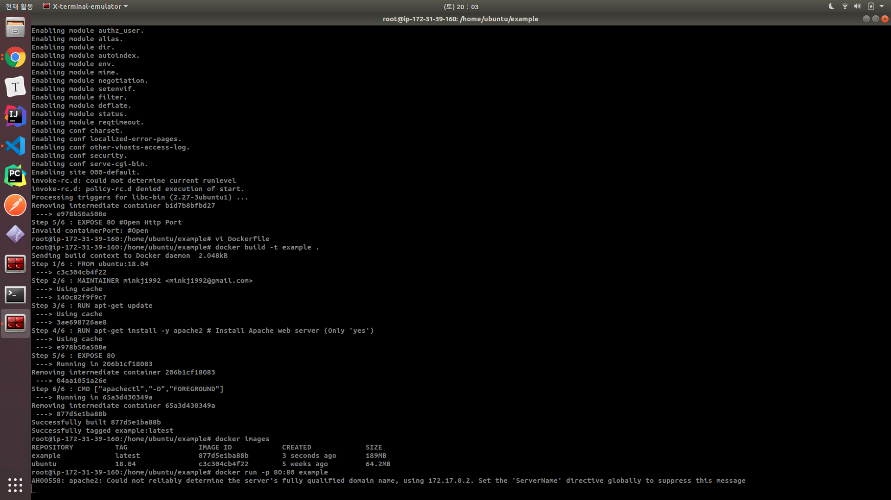
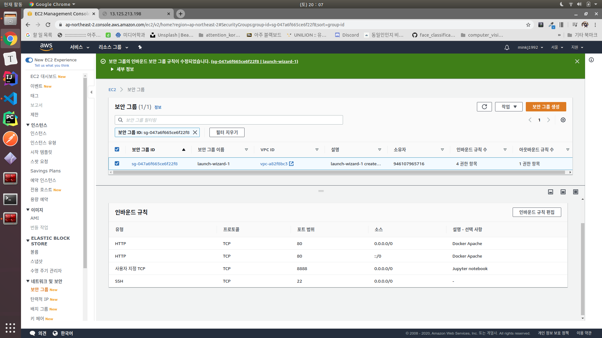
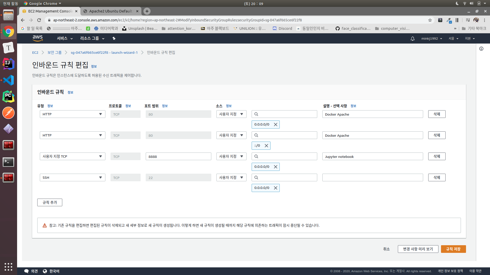
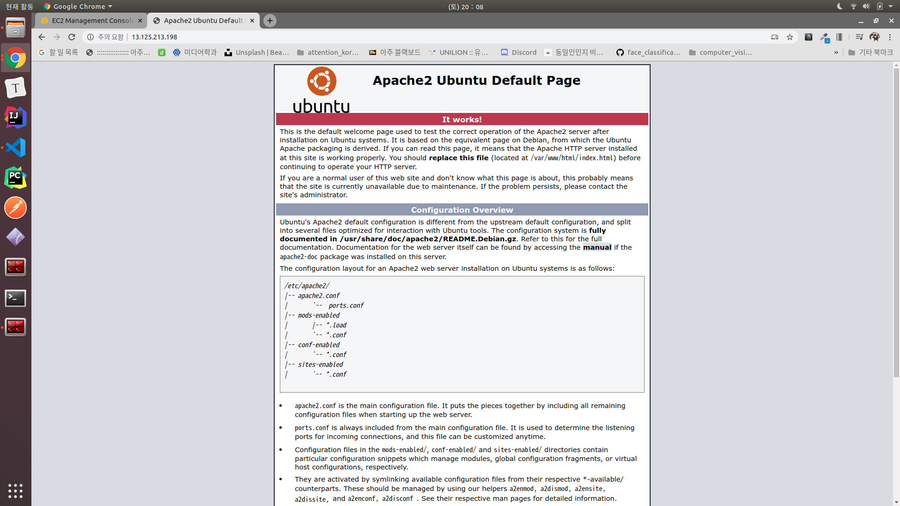

# 3. AWS EC2에 도커(Docker) 설치 및 Dockerfile로 웹 서버 구동시키기

#### ec2 메모리 확인하기
```bash
root@ip-172-31-39-160:/# df -h
Filesystem      Size  Used Avail Use% Mounted on
udev            480M     0  480M   0% /dev
tmpfs            99M  724K   98M   1% /run                                        mp  var      vmlinuz.old
/dev/xvda1      7.7G  1.7G  6.1G  22% /                                           sr  vmlinuz
tmpfs           492M     0  492M   0% /dev/shm
tmpfs           5.0M     0  5.0M   0% /run/lock
tmpfs           492M     0  492M   0% /sys/fs/cgroup
/dev/loop1       94M   94M     0 100% /snap/core/8935
/dev/loop0       18M   18M     0 100% /snap/amazon-ssm-agent/1566
```

#### 도커 설치
```bash
ubuntu@ip-172-31-39-160:~$ sudo apt install apt-transport-https
ubuntu@ip-172-31-39-160:~$ sudo apt install ca-certificates
ubuntu@ip-172-31-39-160:~$ sudo apt install curl
ubuntu@ip-172-31-39-160:~$ sudo apt install software-properties-common
ubuntu@ip-172-31-39-160:~$ curl -fsSL https://download.docker.com/linux/ubuntu/gpg | sudo apt-key add -

ubuntu@ip-172-31-39-160:~$ sudo add-apt-repository \
   "deb [arch=amd64] https://download.docker.com/linux/ubuntu \
   $(lsb_release -cs) \
   stable"

ubuntu@ip-172-31-39-160:~$ sudo apt update
ubuntu@ip-172-31-39-160:~$ sudo apt install docker-ce
ubuntu@ip-172-31-39-160:~$ sudo systemctl status docker

```

#### 로컬에서 aws terminal root권한 받기
```bash
ubuntu@ip-172-31-39-160:~$ sudo passwd root
Enter new UNIX password: 
Retype new UNIX password: 
passwd: password updated successfully
ubuntu@ip-172-31-39-160:~$ su root
Password: 
root@ip-172-31-39-160:/home/ubuntu# 
```

#### apache 도커 파일
```Dockerfile
FROM ubuntu:18.04
MAINTAINER minkj1992 <minkj1992@gmail.com>

RUN apt-get update
RUN apt-get install -y apache2 # Install Apache web server (Only 'yes')

#Open Http Port
EXPOSE 80 

CMD ["apachectl","-D","FOREGROUND"]
```

#### 도커 build with tag
```bash
root@ip-172-31-39-160:/home/ubuntu/example# docker build -t example .
```

#### Container run
```bash
root@ip-172-31-39-160:/home/ubuntu/example# docker run -p 80:80 example
```



포트 열어주기







#### 도커 삭제하기
```bash
root@ip-172-31-39-160:/# docker rm -f `docker ps -a -q`
```
> 실제로 삭제하는 과정에서 run을 실행하고 나니 ctrl + c 이런 종료 명령을 사용했으나 권한이 돌아오지 못했다. 이를 해결하기 위해서 https로 jupyter notebook terminal을 켜준 뒤, stop이든 삭제해주니 로컬 터미널의 주도권이 돌아왔다.
