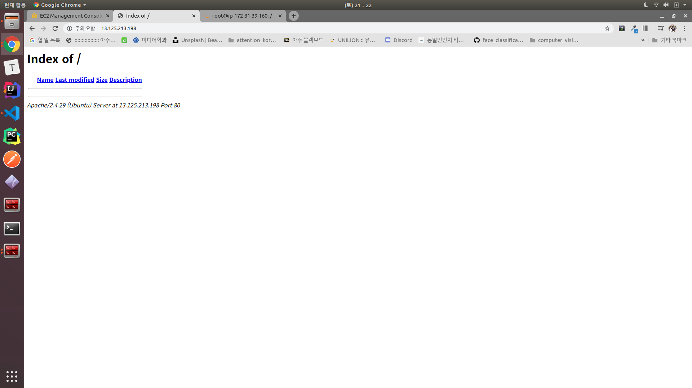
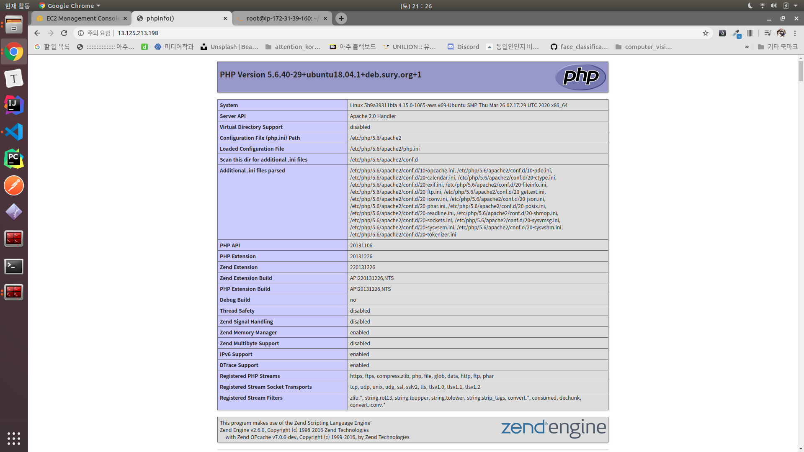

# 4. 도커(Docker) 이미지로 Apache 및 PHP 개발환경 구축하기

#### Dockerfile 추가하기

```docker
FROM ubuntu:18.04
MAINTAINER minkj1992 <minkj1992@gmail.com>

# Avoid User interaction with tzdata
ENV DEBIAN_FRONTEND=noninteractive

RUN apt-get update
RUN apt-get install -y apache2 # Install Apache web server (Only 'yes')
RUN apt-get install -y software-properties-common
RUN add-apt-repository ppa:ondrej/php # For Installing PHP 5.6
RUN apt-get update
RUN apt-get install -y php5.6

EXPOSE 80

CMD ["apachectl","-D","FOREGROUND"]
```
Dockerfile을 실행하고 있을때는 interaction 관련해서는 `noninteractive`으로 설정해주어야 문제 없이 진행된다.


#### Docker RUN
```bash
root@ip-172-31-39-160:/home/ubuntu/example# docker run -p 80:80 -v /home/ubuntu/example/html:/var/www/html example
```



`/home/ubuntu/example/html/index.php`
```php
<?php phpinfo(); ?>
```



